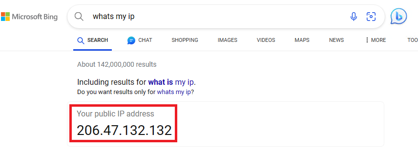

# FortiTrustID

FortiTrustID is a service that encompasses FortiAuthenticator Cloud and FortiToken Cloud

It provides functionality similar to FortiAuthenticator VM or hardware. Refer to the [latest Release Notes document](https://docs.fortinet.com/document/fortitrust-id/latest/fortitrust-identity-23-3-a-release-notes/577670/limitations-of-fortiauthenticator-cloud) (v23.3.a, currently) for limitations.

> Please note FortiAuthenticator Cloud **does not** exist as a standalone product!

## Impossible Travel Detection

In this lab we will go through the experience of a user that logs into a FortiGate from Canada and, shortly after, attempts to login from Japan.

> Any further logins would be detected if speed of transit is above 500 miles per hour

- Open an InPrivate/Incognito and type **"What's my IP"** in the address bar

{ width=50% }

> Write it down or refer back to this IP as you'll see it when we look at the logs

- Now on a new InPrivate/Incognito tab, select bookmark **"FGT US-East"**
- You'll be redirected to FortiTrustID
- If you see screen below, accept the certificate error by selecting **"Advanced"** and then **"Continue to 18.222.156.182 (unsafe)"**

{ width=50% }

- Enter your pod credentials (e.g.: student08) and click **Login**

{ width=50% }

- You'll be prompted for a code

{ width=50% }

- Go to **FortiMail - Webmail** and open the email by FortiToken Cloud with the token code

- Paste the code and click **"Login"**

- Once you're logged in, if you see the screen below, click **"Continue"** 

{ width=50% }

- If you see screen below, click **"Begin"**

{ width=50% }

- In the next screen select **"Comprehensive"** and then **OK**

{ width=50% }

- If the "What's New" video shows next, select **"Don't show again"**

{ width=50% }

- Observe on the **top right-hand side** of the screen that you're logged in via SSO with your student ID

 

> Authentication is using SAML against FortiTrustID and your source IP (the one from the first step) shows "Canada" in FortiToken Cloud (FTC)
>
> { width=50% }

> All adaptive authentication, which includes "Impossible Travel", is handled by FortiToken Cloud

> Due to the complexity to allow multiple people from different organizations to access the same FTC instance we'll look at the actual logs from your atttempts in FTC during the FortiTrustID presentation

- Logout from the FortiGate by selecting logout in the **top right-hand side** dropdown menu under your user ID.

{ width=50% }

{ width=50% }

- Close the tab and open the **FortiClient** console 
- Go to **"Remote Access"** and enter the VPN credentials (i.e.: xperts/F0rtinet!) and click **"Connect"**

{ width=50% }

> Please note ***you will lose connectivity*** to your pod for a few seconds until the VPN connects!
> The session should recover but you might need to refresh your browser after about 30 seconds

{ width=50% }

- Once connected, open the **MAC-Changer** script and select option **"v"** to restart the USB interface service and recover the production NIC. Required due to incompatibility mentioned below
>
> { width=50% }
>
> In a few minutes you should have internet access again. Once you do, proceed to next steps.

> By establishing the VPN you're now in Japan from FortiTrustID's point of view!

> **Optional step:** we'll talk about details of the VPN in a few steps and the Remote Gateway IP that's in use.\
>  If you want to see it, *before connecting or after disconnecting*, select **"View the selected connection"**
>
>    { width=50% }
>
>    { width=50% }

> Due to a compatibility issue between FortiClient and the USB adapter we use for this lab we could not establish the VPN over the production NIC card as it gets removed and the service needs restarting.
> For that reason we won't be able to check our public IP in the same manner as before.
>
> Instead, we will see how the authentication traffic to FortiTrustID is routed over the VPN.

- When logging into **FGT US-East** you get redirected to FortiTrustID.
    - Observe the URL you get redirected to:

{ width=50% }

- Open **Command Prompt** and type `ping -n 1 -w 1 mczwl037.fortitrustid.forticloud.com`
    - The ping <u>will not work</u>, we just want to see the IP address getting resolved.

{ width=50% }

- Now type `route print`
- Scroll to the **"IPv4 Route Table"** section of the output
- Observe the following IPs:
    - **13.208.114.135:** VPN tunnel's Remote Gateway and our public IP address received by FortiTrustID when connected to the VPN
    - **154.52.4.227:** FortiTrustID authentication portal
    - **192.168.80.x:** VPN-assigned IP

{ width=50% }

- From the output we can say that:
    - The VPN Remote Gateway IP points to the POD's management interface (10.162.5.x)
    -  The **gateway for FortiTrustID's** IP is in the **tunnel interface**

> Now we can tell traffic to FortiTrustID takes the VPN

> Once you disconnect, the route to FortiTrustID will be removed from the routing table and traffic to it will take the default-gateway over the production NIC

- Open a new InPrivate/Incognito tab and select bookmark **"FGT US-East"**
- Enter your pod credentials (e.g.: student08) and click **Login**

{ width=50% }

- You're prompted for a token, however, **you never get an email this time!**

{ width=50% }

- That's because FTC has blocked access!

{ width=50% }

- You can close that window
- If you want, disconnect the VPN, open a new private browser tab and login again into **FGT US-East**
- You'll get an email again since your source IP has returned to Canada and you're now allowed to login again.

> Please [click here](https://xperts.fabriclab.ca/xperts/tags/fsb1ozr/) to download your new tag!
> Congratulations, you have completed this section and got a new ZTNA tag!