# FortiPAM
FortiPAM provides privileged access management, control, and monitoring of elevated and privileged accounts, processes, and critical systems across the entire IT environment. 

## ZTNA Controls for Critical Access
Critical assets need to be protected with the highest level of security. FortiPAM allows for enhanced security including zero-trust network access (ZTNA) controls when users try to access critical assets.

ZTNA tags can be applied to check device posture for vulnerabilities, installed AV, location, and more. These checks are done continuously so if something changes on the device, it can be disconnected from the critical asset. In this way, FortiPAM ensures that the users and devices accessing critical assets are secure and prevent threats from impacting the asset.

**Get started:**

- From your POD's browser click on the **FortiPAM** Bookmark
- First attempts to connect should be denied

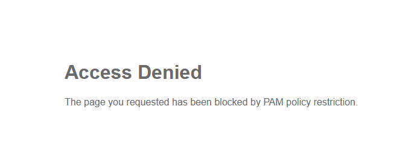{ width=60% }

This is because of your posture on **EMS**, EMS with the help of FortiClient don't see a specific condition on your computer, or you are not on the proper network, etc. 
In this Lab we are using some files on your POD that EMS must see in order to be "Compliant".

___
- Open File explorer and go to the **Document** folder. You should see a certificate file named **FabricLab.crt**
- **Copy or Move** that file to the **Download** folder

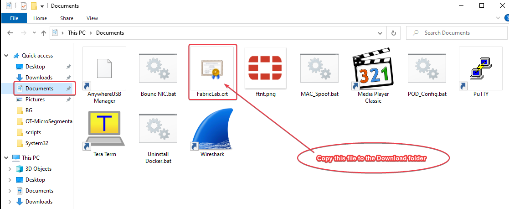{ width=60% }

- Verify on **FortiClient** that you have received the new TAG
- You can see when the next sync will happen with **EMS** and the **TAG** you have here:

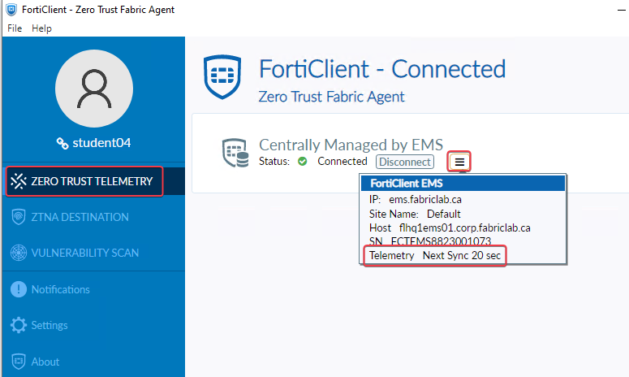{ width=60% }

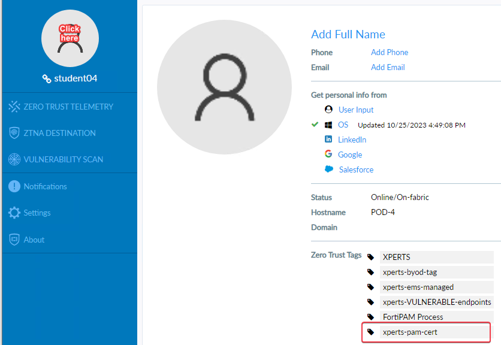{ width=64% }

- Refresh your screen for FortiPAM or click on the Bookmark again
- You will get prompt to choose a certificate
- Select(Click on it) the certificate and click **OK**

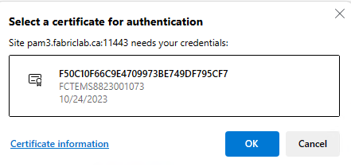{ width=70% }

- Login with your student AD credential (student\<POD_ID\>)/F0rtinet!)
- The main DASHBOARD will be empty, you can add any "Widget" you want, like below:

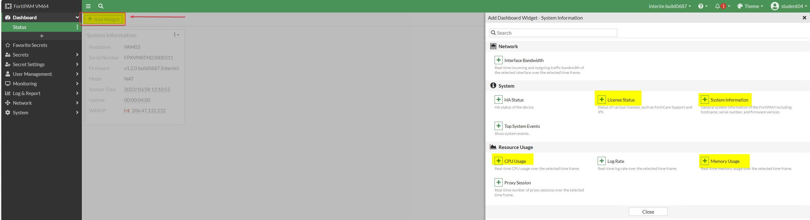{ width=70% }

- Go to **Secrets/Secret List** to see the list of what you can have access.

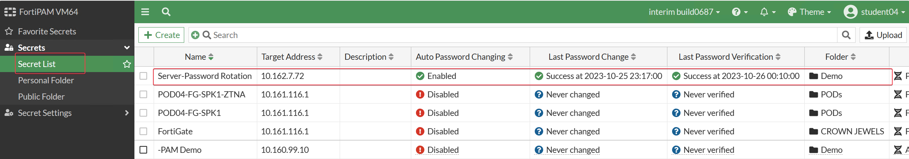{ width=60% }

- Click on the **Server-Password Rotation** and select **Launch Secret** you should have a pop-up like the picture below
- Click on **Putty_v79**

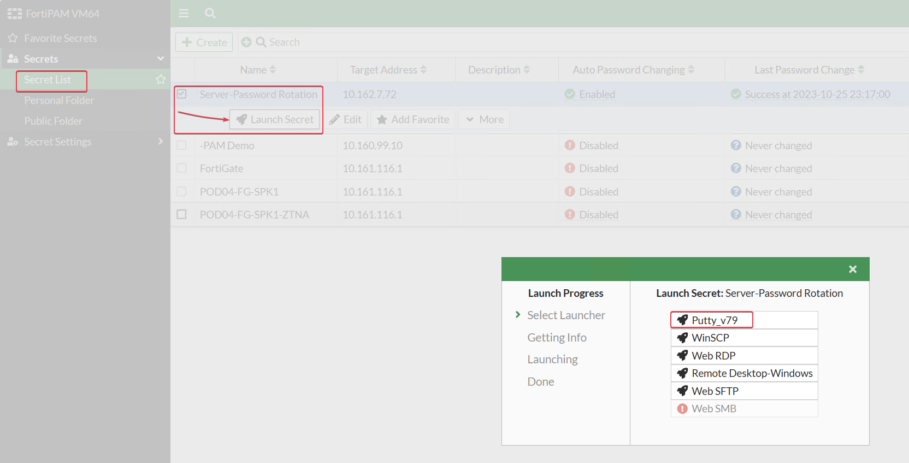{ width=60% }

- You should see an alert that the software you are trying to launch is not on the computer. In this case it is more specific, since we are verifying that the putty version is of a specific version via HASH verification. Since the putty version on your computer is not a valid one FortiPAM will allow you to download the valid version.

- Click the link to download the proper version of **Putty** and then relaunch the secret

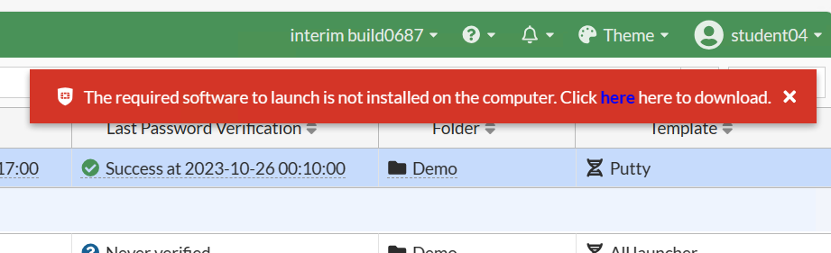{ width=60% }

- Now notice how it successfully started putty and logged you in as **Administrator** without the need for you to know or enter any credentials?
- You can do a few commands here if you want

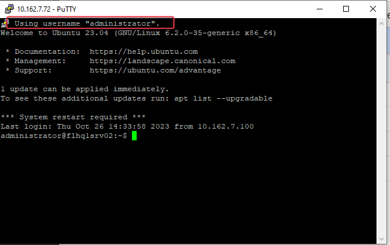{ width=60% }

- Close the Putty session and Click on the Launch again but this time select **Web SFTP**

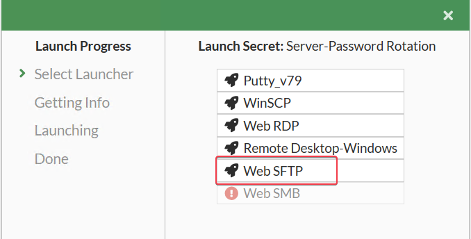{ width=60% }

- If you get a certificate error just accept it.
- Try to download some files to your computer
  - Start with a file with extension **.csv**
  - Then try with a **.txt**
  - Now try to see if you can take a **.exe**

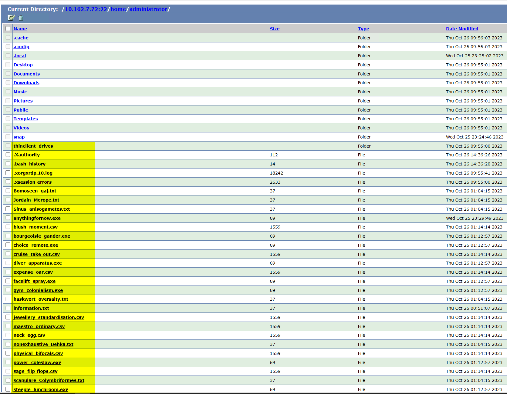{ width=60% }

- If you get the following error it is because **FortiPAM** protected your computer or the server from Downloading or Uploading files that contain Viruses

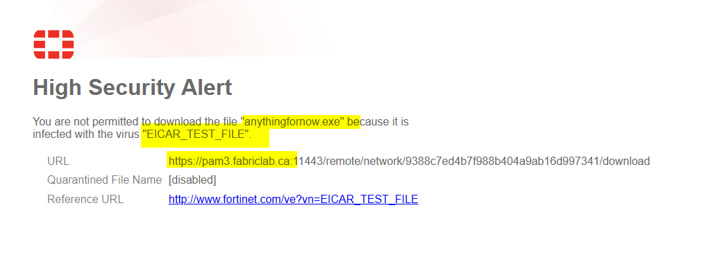{ width=60% }

- Go to **Log & Report/Data Leak Prevention** and explore the logs

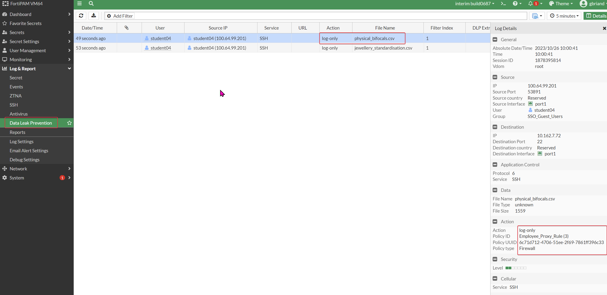{ width=70% }

- **FortiPAM** can inspect traffic and block the ex-filtration of documents with sensitive information or simply alert and keep traces of all the sensitive files downloaded. In this exercise we decided to log any download that contains credit card information.
- Next go to **Log & Report/Antivirus** and explore the logs

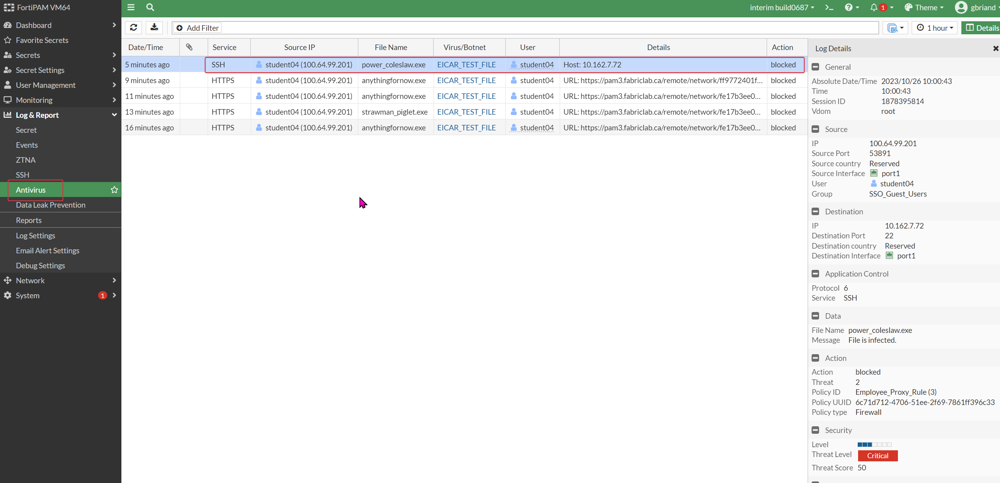{ width=60% }

- **FortiPAM** was able to block any transfer of files that contain viruses

{ width=60% }

### DEMO PAM TARGET

In this environment we have created a secret that demonstrate many of the most popular launchers, use the secret **PAM Demo** to explore with different launcher. Note that not all of theses program are installed on your POD so some like SecureCRT, VNC ect  will not work.

### Password Changer
User name and password/key of servers can be securely stored in FortiPAM as secrets. The secrets contain information on login, credentials, and the target server IP address. The end user can use the secret to access servers.

In FortiPAM, actual credentials are protected, and FortiPAM users cannot access the credentials except in some cases. Login credentials can be changed automatically and manually for different use cases.
Credential History  

FortiPAM retains any previous credentials that have been used by the secret before. These credentials appear in the Credential History tab in the secret page. If the last password change failed, FortiPAM retains the last credential that was tried. You can use the credential history to restore the secret password if the credential on the remote server and FortiPAM are out of sync.

- When editing the "Server-Password Rotation" secret, go to the Credential History tab to see a history of changes made to the password.

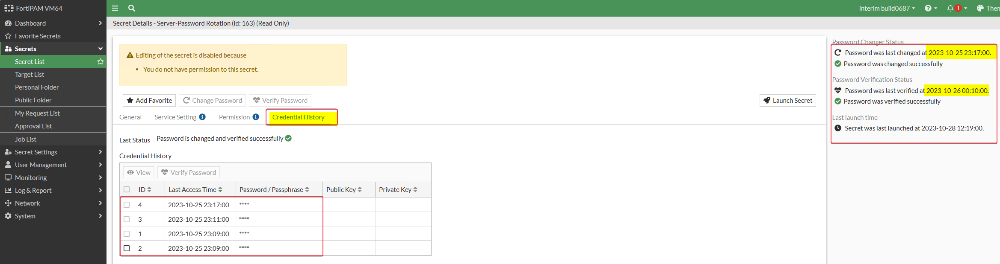

