## SSH Filtering

Next we take a closer look at SSH filtering in **FortiPAM**. In this next example we will illustrate how **FortiPAM** can be used to prevent unwanted SSH commands, and how we leverage **Security Fabric** integration to provide elevated permission.

- In **FortiPAM** **Secrets**, connect to **POD##-FG-SPK1** and select **Web SSH**
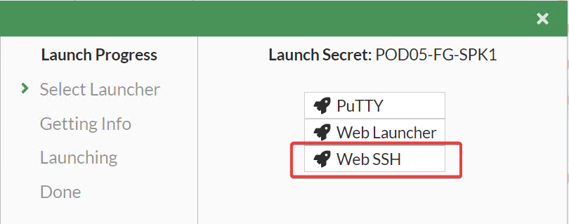{ width=64% }
- Once connected to the **Web SSH** a new tab should be opened. Run the following commands to observe the results.

```text
show
```

- This command should run normally. Press `q` to **quit**

```text
diag
```

**OR**

```text
diagnose sys proxy stats list
```

- Notice how the `show` command ran and `diag` command did not. This is due to the **SSH Filter** preventing the `diag` commands

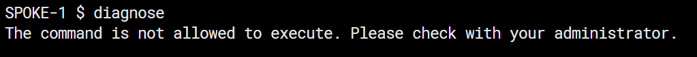{ width=64% }

- Now select the **Secret** named **POD##-FG-SPK1-ZTNA** and launch the **Web SSH** **Secret**

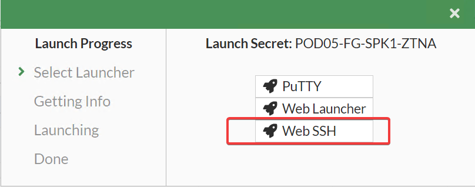{ width=64% }

- By connecting successfully, **FortiPAM** has evaluated your **ZTNA Tags** and has let you connect to the **Secret**

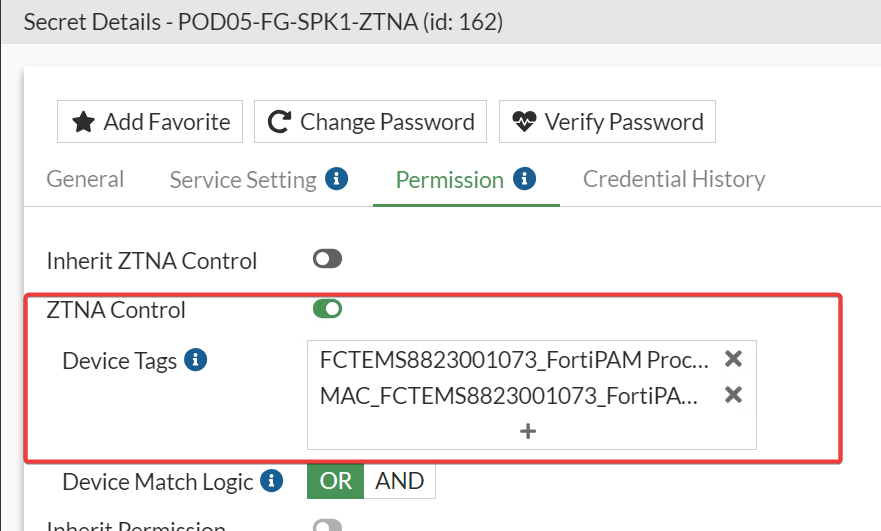{ width=64% }

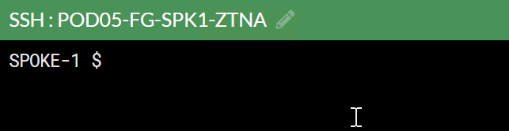{ width=64% }

- Now try running a `diag` command

```text
diagnose sys proxy stats list
```

- Was your `diag` command successful? It will return nothing, but you did not get blocked.

An administrator of **FortiPAM** would be able to see the logs generated from our actions. Below are logs of **ZTNA** events.

This is the **ZTNA Access** to the **Secret**

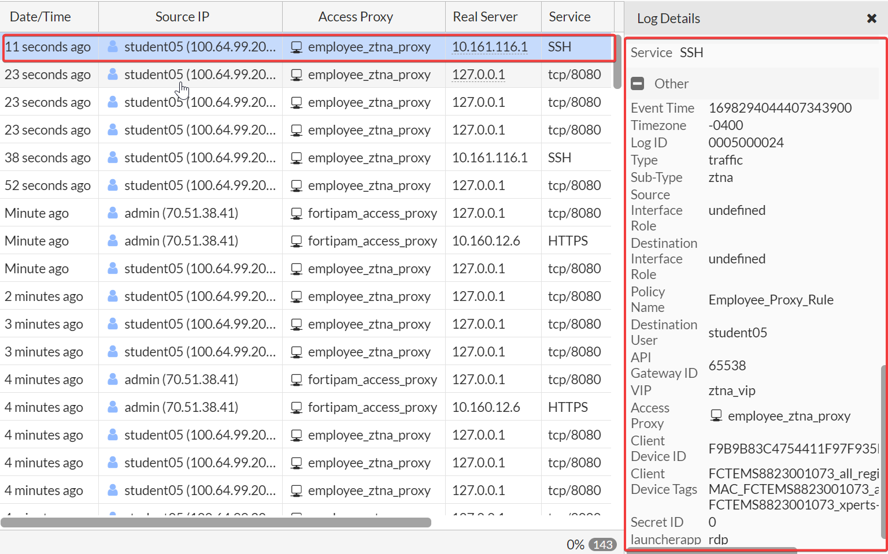{ width=64% }

We see a log of the **SSH Filter** blocking a command when connected to our **non-ZTNA Secret**.

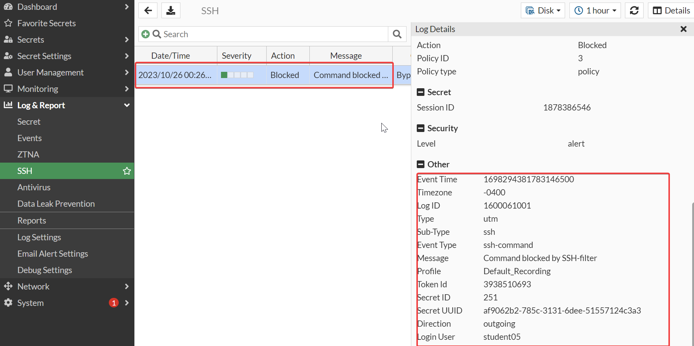{ width=64% }

After connecting to our **ZTNA Secret** we see a log of the diagnose command being allowed through the **SSH Filter**

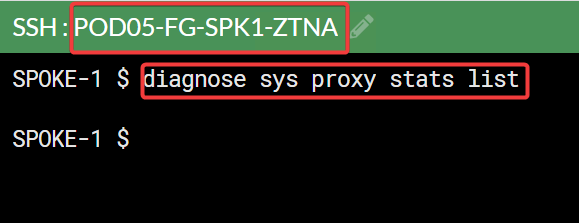{ width=64% }

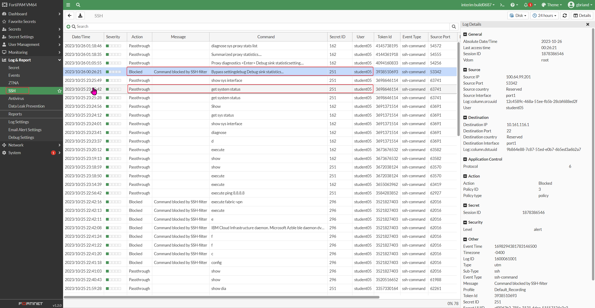{ width=64% }

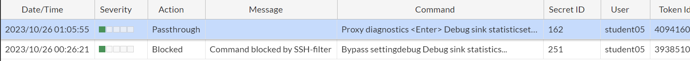{ width=64% }

## Log & Report
Logging and reporting are valuable components to help you understand what is happening on your network and to inform you about network activities, such as system and user events.

Reports show the recorded activity in a more readable format. A report gathers all the log information that it needs, then presents it in a graphical format with a customizable design and automatically generated charts showing what is happening on the network.


## Secret Video
Selecting Secret Video shows logs related to secret videos. This category of the secret log shows all the videos of launched secrets from FortiPAM. It is helpful to assist in auditing a user's behaviour on the secret, ensuring that no malicious activity is performed.

To view a recorded video of a launched secret, select the log with the operation labelled as Video Finish, then click the Details button located at the right of the menu button. Once the slider opens up, the administrator can see the video player.

- In the Log & Report section as shown below go and explore all the log available to you.

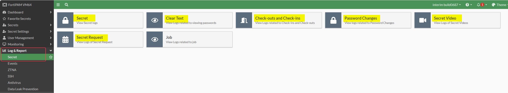

- One interesting feature is the ability to replay video, find your session and see the recording

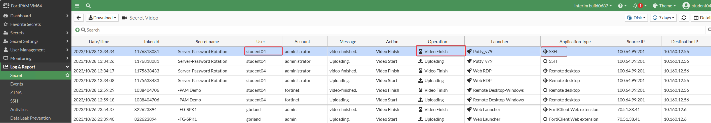


## Approval request

- For this final exercise you will have to request access to this secret to complete this lab.
- In the Secret List click on "XPERT Certification"

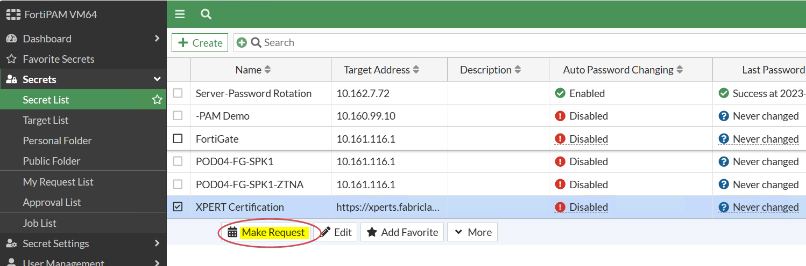{ width=64% }

- This will send a request and if approved you will be able to launch this secret. You can see how this feature can be very useful for on-demand access for contractors etc...
- Fill in the duration and any message you want to send to the approvers.
- You can verify the status of your "request" in the "Secrets/My Request List"

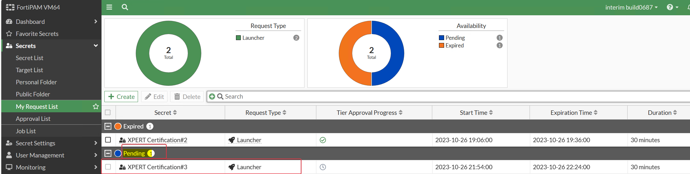{ width=64% }

- Once approved by one of the instructors double click the request to see the details.
- When you are done reviewing you can go to secret to launch

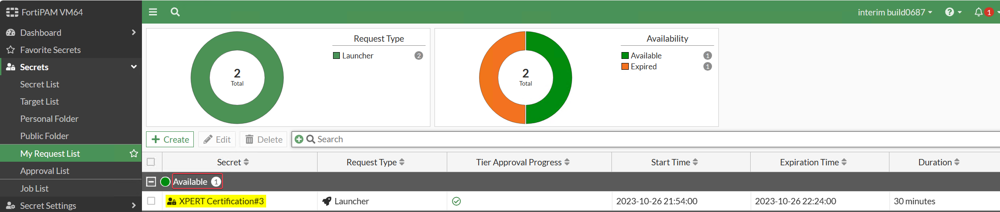{ width=64% }

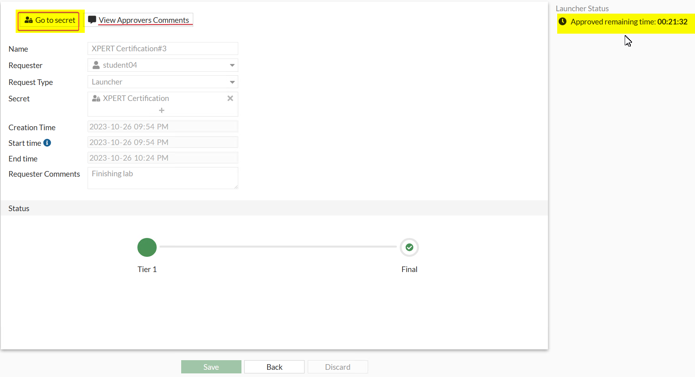{ width=64% }

## Check out and check in a secret
Checking out a secret gives you exclusive access to the secret for a limited time.

Checking in a secret allows other approved users to access the secret.


- For this server we wanted to make sure that only one administrator at a time can connect, to do that you will "Check-out Secret" this mean that no one else will be able to launch this secret while you are in.
- Click "Check-out Secret"

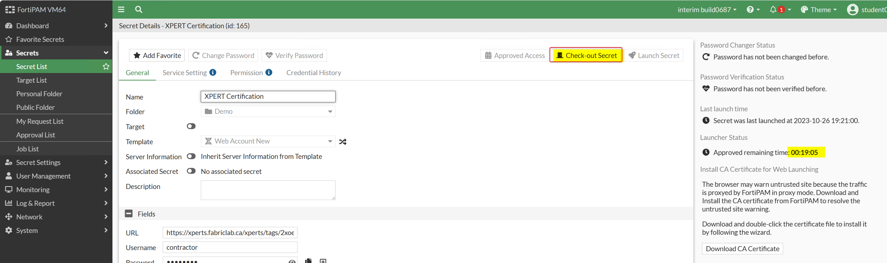{ width=64% }

- Review the checkout details. For this checkout we have configured the maximum duration of three minutes so in the picture below there are 2:52 minutes left to the checkout, after this time elapse the session will be terminated and a new request would have to be done to connect again. In the case you would have the duration set for a much longer period, you can "Check-IN Secret

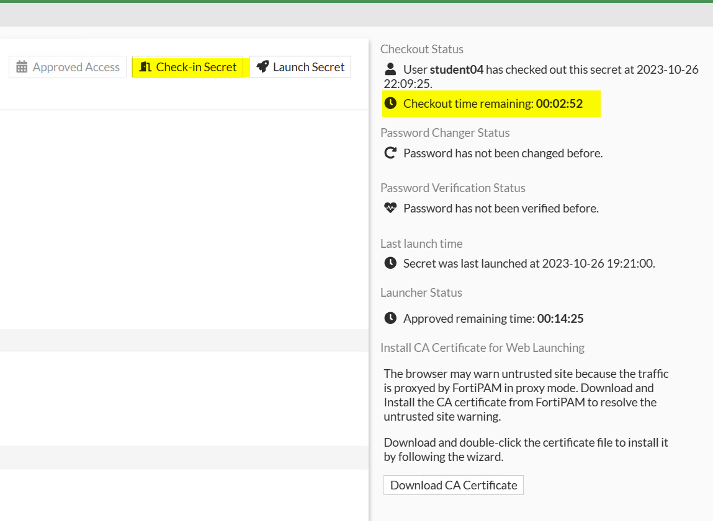{ width=64% }

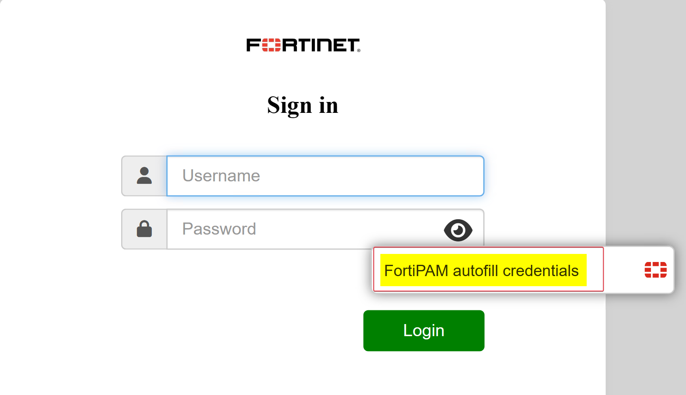{ width=64% }

- Download your "Certification TAG"

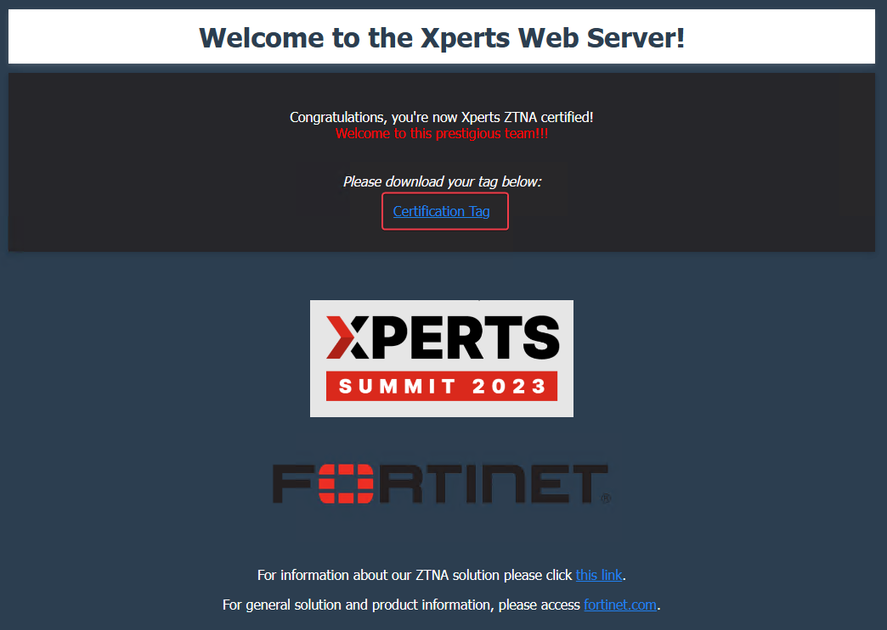{ width=64% }

> Congratulations, you have completed this section!
