# OT and Microsegmentation

### How Microsegmentation Works
If you want to achieve true application segmentation, microsegmentation is a good choice. It allows you to isolate the workloads of individual applications. With this in place, you can prevent the lateral movement of threats, trapping them within the isolated segment that houses the application the threat targeted.

Microsegmentation also provides superior visibility into the network. Because you can isolate individual segments and monitor each one using a specific dashboard, you can customize your alert and alert management systems on a segment-by-segment basis. You can, for example, apply microsegmentation to a specific device or set of devices based on who will be using them, which could provide granular visibility into the activity happening within each component that has been microsegmented.

For security purposes, microsegmentation allows you to create more flexible solutions because you can microsegment individual workloads and then apply security policies specifically designed to keep them safe. If a threat tries to invade your network, microsegmentation can help you detect it faster as well. 

Each segment can have its own security “wall” around it. As the threat attempts to move from segment A to segment B, it can be detected by both the protections around segment A as it tries to leave and those around segment B as it tries to enter. For example, a system may employ a highly sensitive database workload that contains the credit card information of thousands of customers. Using microsegmentation architecture, you can apply extra security measures to protect the data held within.

In this environment we have configured the FortiNAC profiling, group and structure to align with the Perdue Model

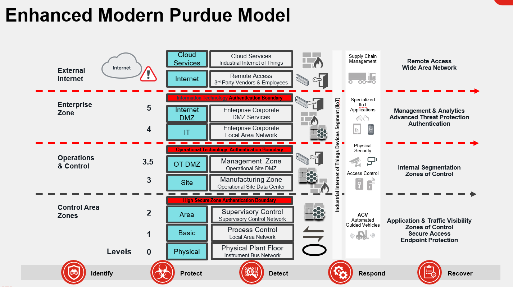{ width=70% }

The goal of this environment is to show that traditional network architecture of segmenting physical function of the network can be done with a single broadcast domain and leverage FortiNAC, FortiSwitch and FortiGate to achieve intent based policy or if you prefer MicroSegmentation.

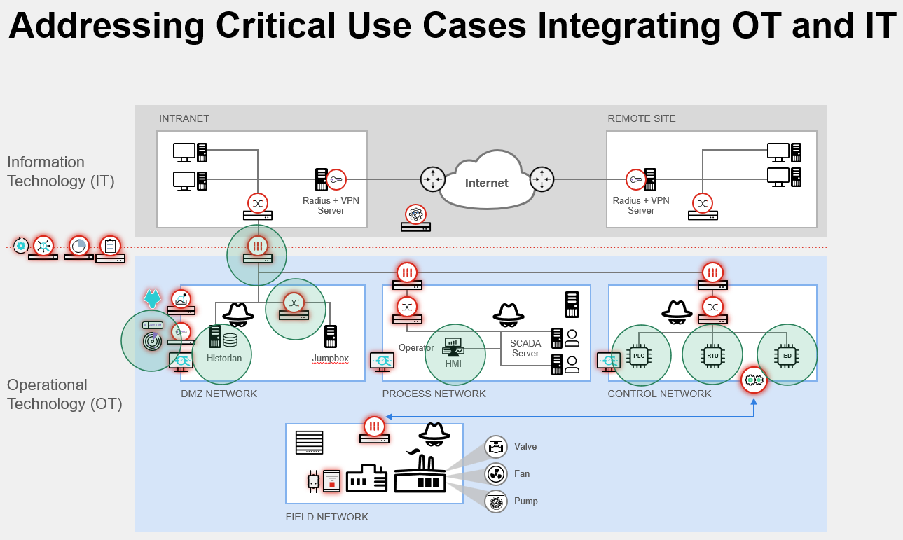{ width=70% }

In an O.T. Environment we must ensure that segmentation allows the OT devices to work with devices at the same perdue level. We leverage microsegmentation to ensure devices can only communicate with devices as defined through policy at the appropriate perdue level.

___
## Microsegmentation in an OT Lab

In this lab you will live in the process of a number of devices within a pre-configured OT setup and understand what the device will perceive as well as understand the concepts of the Microsegmentation within the Demo infrastructure within the XPERT lab.

The lab architecture is shown in the diagram below:

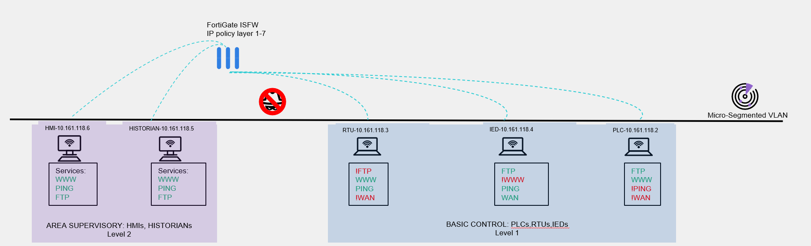{ width=100% }

This is correct, everything is on the same VLAN! but the magic happens in the configuration of the **FortiGate**, **FortiSwitch** and **FortiNAC** more on that later!

The services allowed from each type of devices are listed under each device and it is like this:

OT Device         WAN    HTTP    FTP   PING
--------------   -----  ------  ----- ------  
PLC                N       Y      Y     N
IED                Y       N      Y     Y
RTU                N       Y      N     Y

For example, the PLC's are able to browse on local subnet and reach other devices web pages but are not able to surf the WEB or PING, lastly the PLC's are also able to reach the FTP server.

The **MAC_Changer batch file** will allow your computer to replicate the MAC of a number of devices from the **Base Control** level 1.

Each time you change your MAC you will be re-profiled by the **FortiNAC** and your Dynamic TAGS will also reflect on the **FortiGate** firewall policies and dictate what services you can reach as per the table above.

--------------   -----  ------  ----- ------  

### Preparation

- OT devices typically don't have any agent installed on them let's remove at least **FortiNAC agent**
    - You can stop the service **"FortiNAC Persistent Agent"** or
    - Uninstall the software completely.

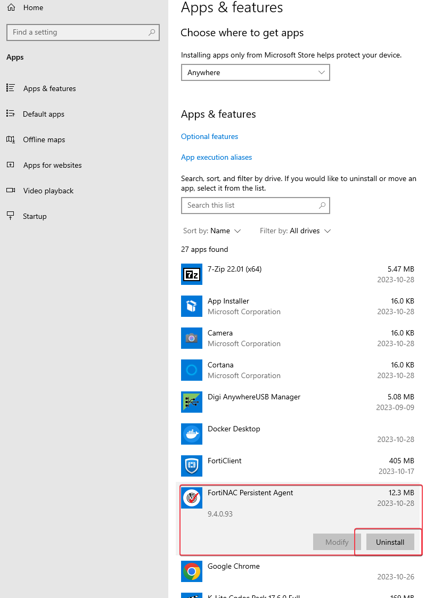{ width=50% }

- Locate the shortcut on your Desktop **"MAC_Changer"**

- Select Option 3 to change your POD into a **Remote Terminal Unit(RTU)**

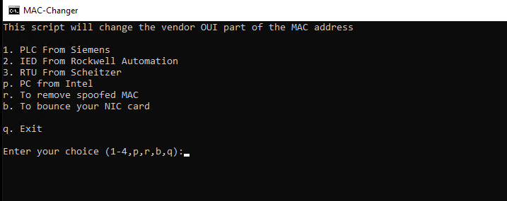{ width=70% }

     - On **FortiNAC** Go to Network/Inventory you should see your port show the icon of the OT device you just selected.

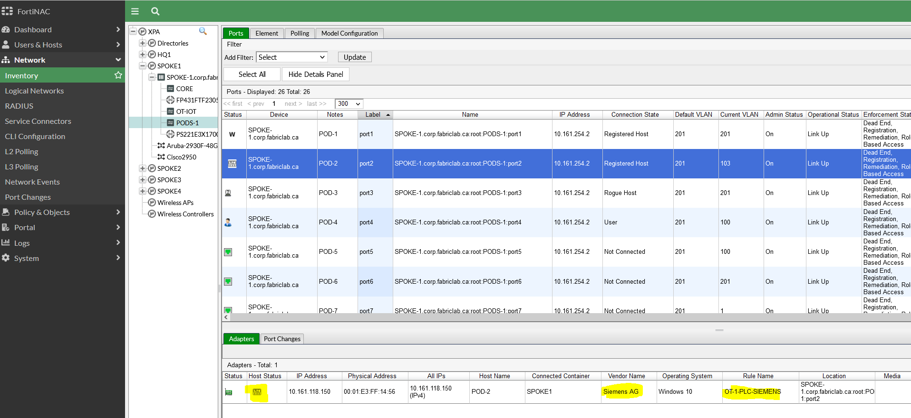{ width=70% }

    - You can validate under  User&Host/Host the policy that now matches your device. It is normal to see multiple host entry for your POD since you have registered multiple MAC address with different roles(guest, BYOD, Corporate) and now as a RTU

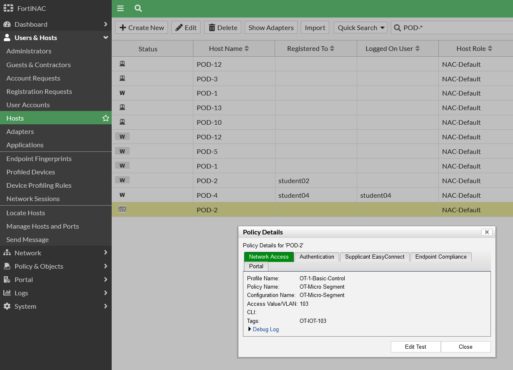{ width=70% }

First you will try to use your browser to surf the web and other machines on the network.

- On your **POD** Open Google and notice the **OT-MicroSegmentation** folder in the bookmarks tab.

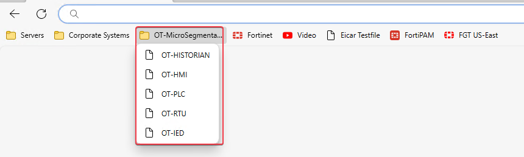{ width=70% }

    - Try connecting to other devices on your network(PLC,RTU,IED,HMI,HISTORIAN)
    - Try surfing the WEB

Did you succeed? Do you understand why?
You can go to the **FortiGate** to see the policy that is responsible for blocking or allowing your traffic
Also see the Dynamic TAG under **Policies & Objects/Addresses**

Now try with the other type of services....

To make your life easier we included shortcut to **PING** and **FTP** to both servers in the **OT-MicroSegmentation** folder on your Desktop and you will also find **Bookmarks** on your browser in a folder named **OT-MicroSegmentation**

SHORTCUTS:

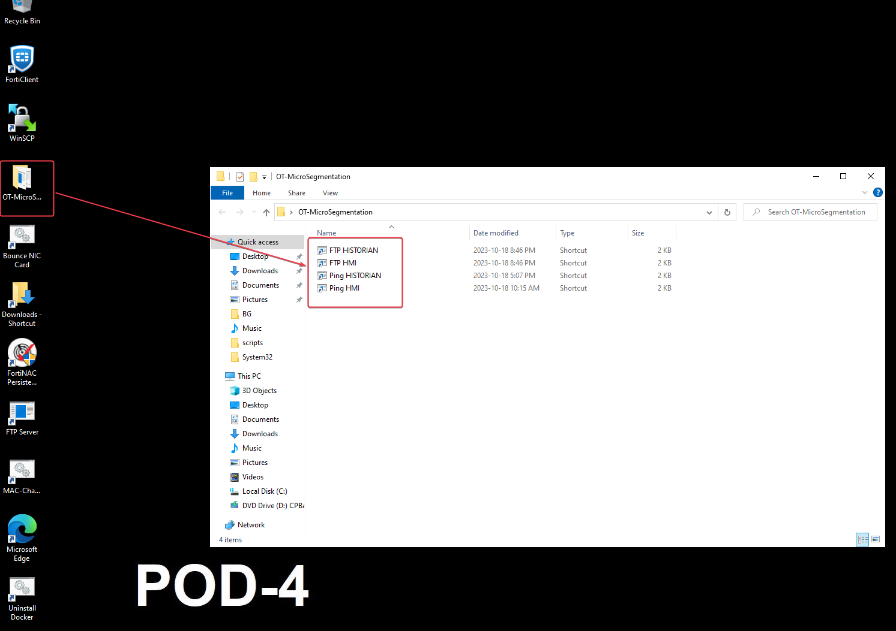{ width=70% }

BOOKMARKS:

{ width=70% }

Perform actions to validate the access you have:

- Can you **PING** the **HMI** and the **HISTORIAN** ?
- Can you **FTP** to the **HMI** and **HISTORIAN** ?
-- Login with **"anonymous"** and **no password**
- Using your browser can you reach the web page of each device?

Now repeat the step above to become a **PLC** and a **IED**.

>NOTE: If you are able to connect to the **FTP** server make sure you retrieve your **TAGS!!!**

If you received the following block message, it is normal, see the firewall policy #22 on the FortiGate and you will understand:

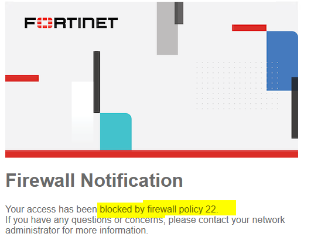{ width=50% }

- Review the **FortiGate**
- Under **Wifi and Switch Controller** go to **Fortiswitch** vlans and review the configuration of the **MicroSegment OT Devices (IOT) Vlan**

-- Do you see the setting responsible for this?

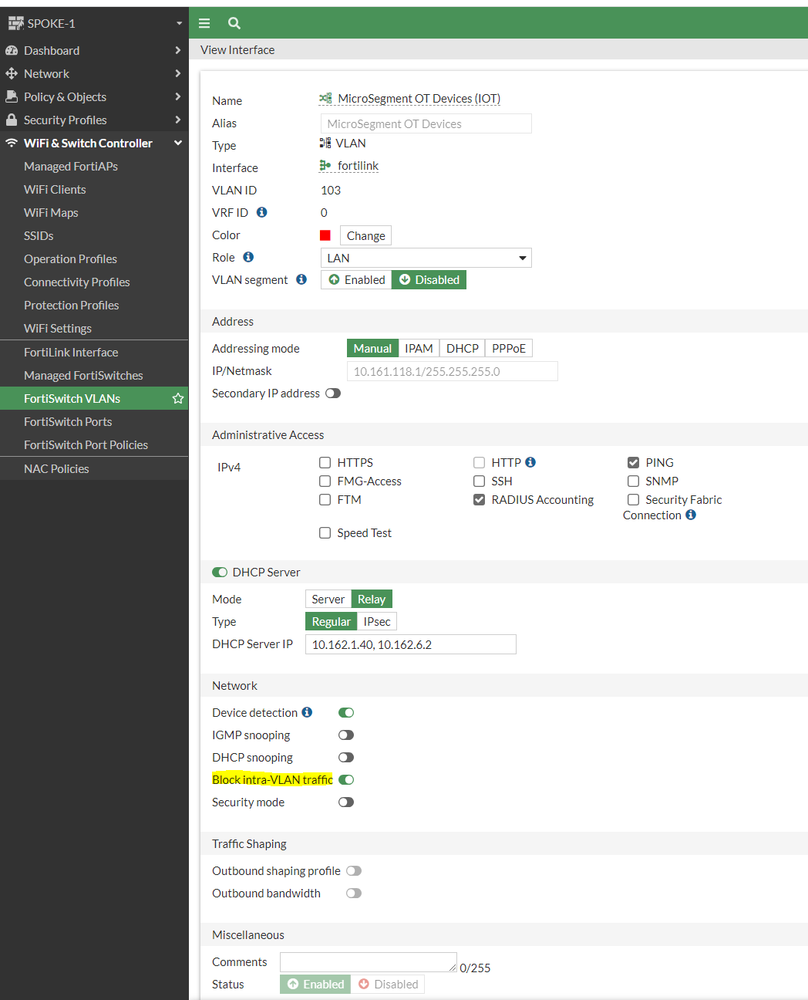{ width=70% }

### Details

**Block Intra-VLAN traffic** is a feature that forces all traffic to go up to the **FortiGate**, it then needs to match a policy to go back down to the same interface or anywhere else. If you combine this with the **Dynamic FortiNAC tag**, you have a powerful solution to only allow very specific traffic for every type of device on your network.

1. Under **Policy and Objects** go to **Addresses** and review the **FortiNAC Tags** e.g. **(OT-IED)**

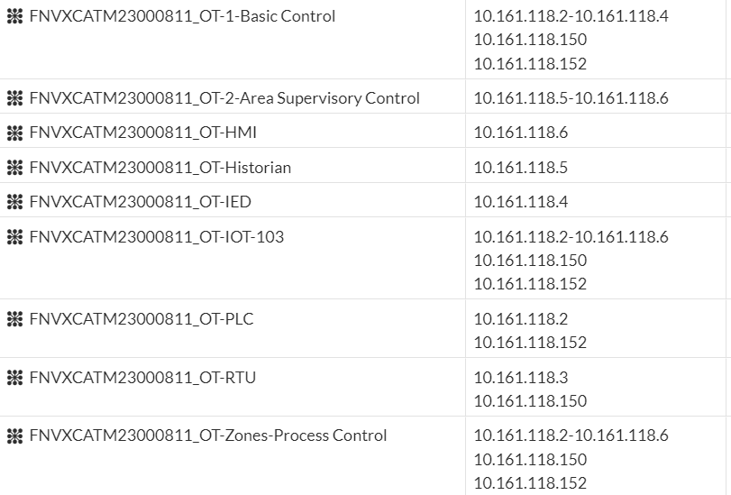{ width=70% }

2. Under **Policy and Objects** under **Firewall Policy**. review the policies for **OT devices**

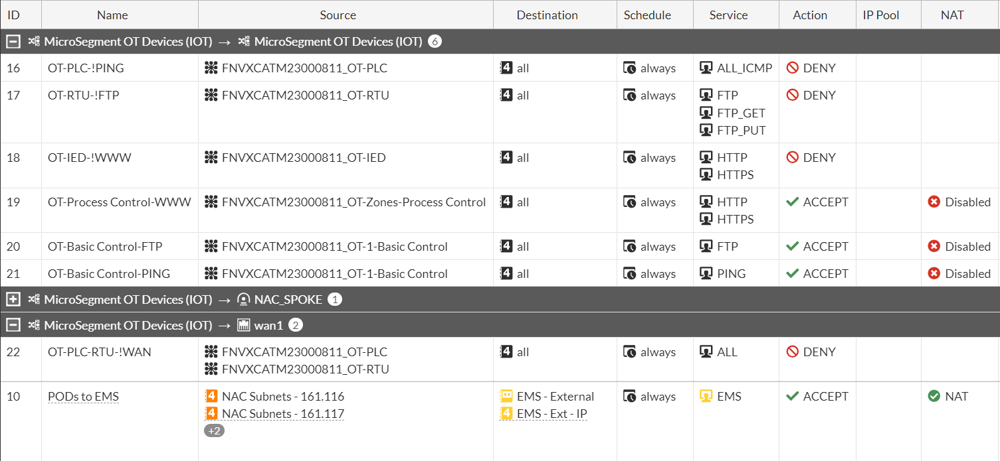{ width=70% }

3. On **FortiNAC** and review the policies for OT and the respective vlans.

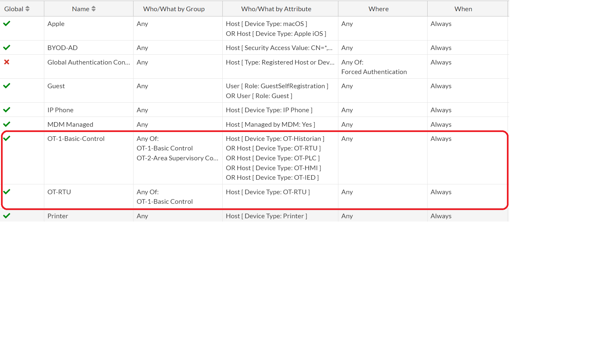{ width=70% }
