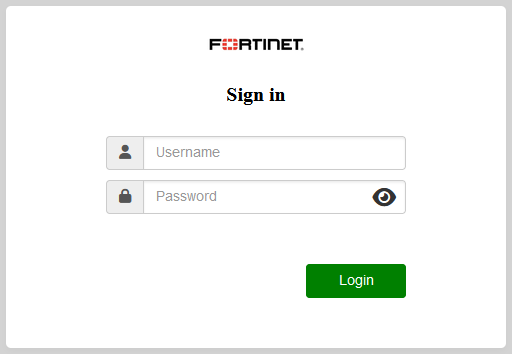

# Welcome to the Xperts ZTNA Track

## Introduction
Welcome to the Fortinet Xperts Workshop, the ultimate adventure in the Fortinet Universe! 🚀

You are about to explore the Fortinet Security Fabric, a powerful and integrated platform that delivers unmatched protection and visibility across the entire digital attack surface. You will discover how to use the Fortinet Zero Trust Network Access solution, which enables secure access to applications and data from any device, location, or network.

Your mission is to collect all the tags across the Fortinet Security Fabric, which represent different aspects of the user and admin experience. Each tag will reveal a new level of knowledge and insight into how Fortinet solutions work together to provide end-to-end security.

You will also get to experience the amazing features of the following components of the hands-on lab:

- FortiClient, which provides endpoint security and Zero Trust Network Access agent.
- FortiNAC, which provides network access control, visibility, and incident response.
- FortiOS, which is the operating system that powers the FortiGate firewall and acts as a ZTNA Proxy.
- FortiPAM, which provides privileged access management and session recording.
- FortiTrust Identity, which provides identity verification and multi-factor authentication.

Are you ready to take on this challenge? Then strap in and get ready for a thrilling ride through the Fortinet Universe! 🌟

We hope you enjoy this hands-on lab and have fun learning with us. Thank you for choosing Fortinet as your trusted partner in cybersecurity. 😊

Canada CSE team

___

| **POD#** | **STUDENT NAME** | **STUDENT ID** | **PASSWORD** |
|:---------|:-----------------------:|:----------------:|:------------:|
|	POD-1	|	Alexandre Liboiron	|	student01	|	F0rtinet!	|
|	POD-2	|	Bradley LaCroix	|	student02	|	F0rtinet!	|
|	POD-3	|	Christian Castillo	|	student03	|	F0rtinet!	|
|	POD-4	|	Daniel Adeyemo	|	student04	|	F0rtinet!	|
|	POD-5	|	Darshak Patel	|	student05	|	F0rtinet!	|
|	POD-6	|	Ehsan Abedi Moghaddam	|	student06	|	F0rtinet!	|
|	POD-7	|	Francois Banville	|	student07	|	F0rtinet!	|
|	POD-8	|	Jean Daniel Douce	|	student08	|	F0rtinet!	|
|	POD-9	|	Jean-François Fortin	|	student09	|	F0rtinet!	|
|	POD-10	|	Jonathan Morin	|	student10	|	F0rtinet!	|
|	POD-11	|	Kevin Grant	|	student11	|	F0rtinet!	|
|	POD-12	|	Mahdi Far	|	student12	|	F0rtinet!	|
|	POD-13	|	Maryam Karimi Makiabadi	|	student13	|	F0rtinet!	|
|	POD-14	|	Matthew Watkinson	|	student14	|	F0rtinet!	|
|	POD-15	|	Maxime Lalonde	|	student15	|	F0rtinet!	|
|	POD-16	|	Nelson Pereira	|	student16	|	F0rtinet!	|
|	POD-17	|	Pascal Dery	|	student17	|	F0rtinet!	|
|	POD-18	|	Patrick Kamgueu	|	student18	|	F0rtinet!	|
|	POD-19	|	Paul Landry	|	student19	|	F0rtinet!	|
|	POD-20	|	Phillippe Gagné	|	student20	|	F0rtinet!	|
|	POD-21	|	Raihan Khan	|	student21	|	F0rtinet!	|
|	POD-22	|	Reid Nilson	|	student22	|	F0rtinet!	|
|	POD-23	|	Ryan Totten	|	student23	|	F0rtinet!	|
|	POD-24	|	Siavash (Sia) Kazemi	|	student24	|	F0rtinet!	|

___

| **POD#** | **STUDENT NAME** | **STUDENT ID** | **PASSWORD** |
|:---------|:-----------------------:|:----------------:|:------------:|
|	POD-1	|	Adam Boss	|	student01	|	F0rtinet!	|
|	POD-2	|	Antoine Garcia	|	student02	|	F0rtinet!	|
|	POD-3	|	Barthélémy Thiaw	|	student03	|	F0rtinet!	|
|	POD-4	|	Carlos Winters	|	student04	|	F0rtinet!	|
|	POD-5	|	Charanjeet Singh	|	student05	|	F0rtinet!	|
|	POD-6	|	Darren Wessely	|	student06	|	F0rtinet!	|
|	POD-7	|	Diego Lara	|	student07	|	F0rtinet!	|
|	POD-8	|	Husien Omer	|	student08	|	F0rtinet!	|
|	POD-9	|	Jason Terpstra	|	student09	|	F0rtinet!	|
|	POD-10	|	Keven Duchesneau	|	student10	|	F0rtinet!	|
|	POD-11	|	Maxime Gariepy	|	student11	|	F0rtinet!	|
|	POD-12	|	Michael Zhang	|	student12	|	F0rtinet!	|
|	POD-13	|	Michel Morel	|	student13	|	F0rtinet!	|
|	POD-14	|	Montasir Mirza	|	student14	|	F0rtinet!	|
|	POD-15	|	Oral Shaw	|	student15	|	F0rtinet!	|
|	POD-16	|	Patryk Aksamit	|	student16	|	F0rtinet!	|
|	POD-17	|	Paul Zhao	|	student17	|	F0rtinet!	|
|	POD-18	|	Philippe Auger-Morin	|	student18	|	F0rtinet!	|
|	POD-19	|	Robin Stuart	|	student19	|	F0rtinet!	|
|	POD-20	|	Saif Kassab	|	student20	|	F0rtinet!	|
|	POD-21	|	Sébastien Jutras	|	student21	|	F0rtinet!	|
|	POD-22	|	Thom Spring	|	student22	|	F0rtinet!	|
|	POD-23	|	Véronique Cabana	|	student23	|	F0rtinet!	|
|	POD-24	|	Vidura Abeysinghe	|	student24	|	F0rtinet!	|

___
## Getting started

- Navigate to [https://xperts.fabriclab.ca](https://xperts.fabriclab.ca "Xperts Landing Page")
- **Log in** using your received credentials (student\<POD_ID\> / F0rtinet!)
  - You will need to accept the certificate error

{ width=50% }

### Landing Page

This section aims to show the different options in the landing page, clicking the tiles is not required at this point. They'll be used once you start the actual lab.

- The landing page contains tiles with different options

{ width=50% }

___

- **Documentation** is the HTML version of the lab guide

{ width=50% }

- **PODS** provide access to your lab environment
  - You'll use credentials xpertsztna/F0rtinet! on the page that opens

{ width=50% }

  > Here is where you can **RDP** into the environment

- **Resources** provide access to the PDF version of the lab guide and software

{ width=50% }

- **HoL** provides access to the Hands On Labs

{ width=50% }

___

## Credential information:

| **Host/User** | **Login** | **Password** |
|:---------------------|:-----------------------:|:------------:|
| xperts.fabriclab.ca |  student\<POD_ID\> (e.g. student03)   |   F0rtinet! |
| fabriclab.ca (PODs page) |  xpertsztna |  F0rtinet!
| PODs (via direct RDP) |       MGMT                                 |   F0rtinet! |
| SSH Server |           student\<POD_ID\>                    |   F0rtinet! |
| EMS Registration |     student\<POD_ID\>                    |   F0rtinet! |
| FTP Server |           xperts                               |   F0rtinet! |
| FTP HMI |              anonymous                            |   <No Password> |
| FTP HISTORIAN |        anonymous                            |   <No Password> |
| IT             |       admin                                |   F0rtinet! |
| Accountant      |      admin                                |   F0rtinet! |

___

## Lab Topology

We will be using the environment below to go through the different tasks in the lab.

___

## Connect to FabricLAB

- To get started click on the "Bookmarks" section of the xperts landing page

{ width=50% }

- Then Click **View** for the **PODS** bookmarks

- Now you will get prompt the enter credential to access to lab.
- Enter **xpertsztna/F0rtinet!**

-FabricaLAB contain many different labs that we call story, but for today we only made the ZTNA story available to you, so go ahead and enter this **XPERTSZTNA** story to experience what was prepared for you!

- From this page you will see all the links to your environment, each of you have:
1 x POD assigned for the duration of the lab
2 x Common devices that consist of a FortiGate and a FortiNAC

{ width=50% }

[THIS IS A HIDDEN COMMENT - REFERENCE ONLY IN CASE THEIR REQUIRED: .]: #
